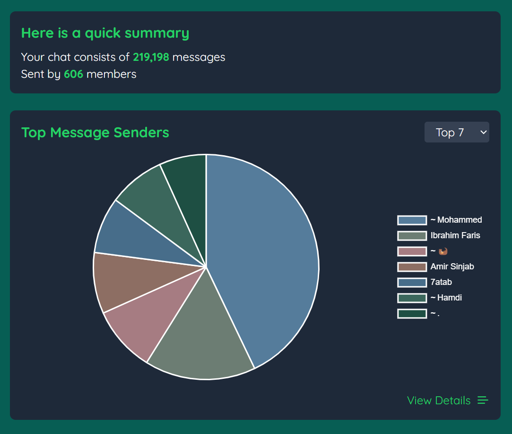
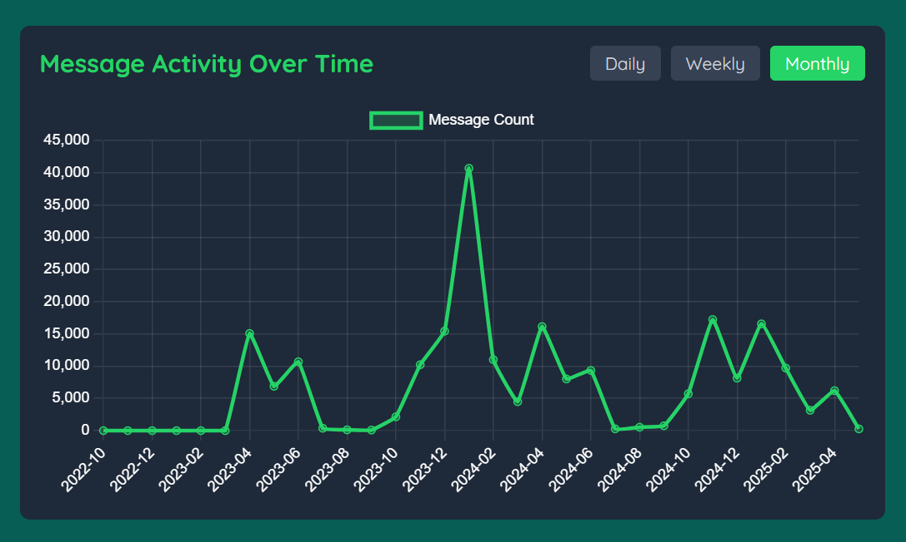
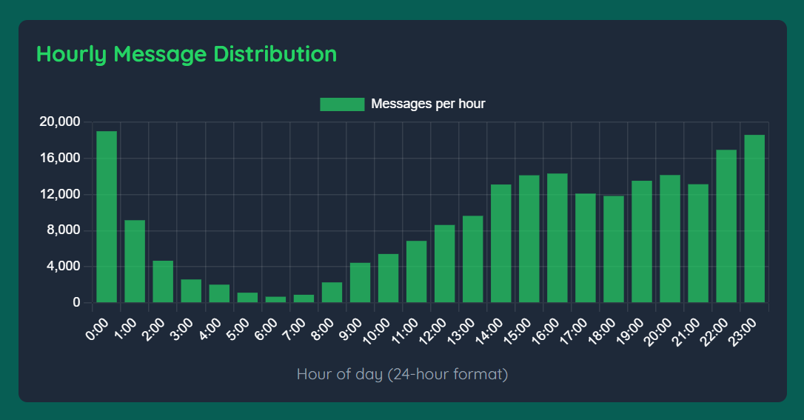
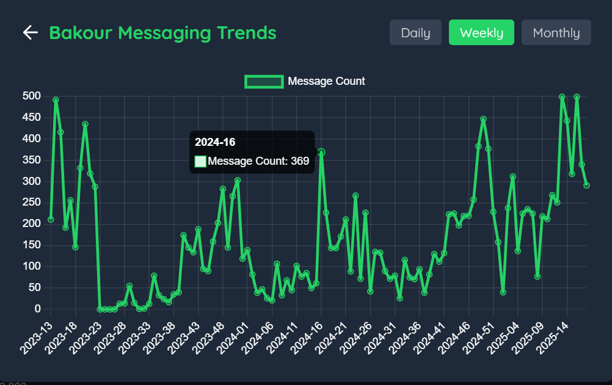
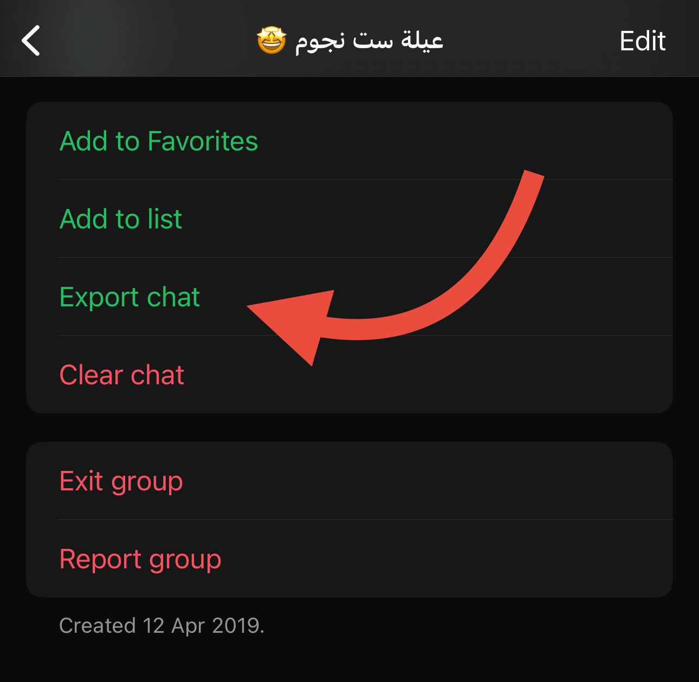

# WhatStats - WhatsApp Chat Analyzer


WhatStats is a tool that provides in-depth analysis and visualization of WhatsApp chat data. Upload your exported WhatsApp chat file and get insightful statistics and interactive charts.

## Features

-   📊 **Visual Analytics**: Interactive pie charts showing most frequent senders
-   📈 **Time Series Analysis**: View chat activity patterns over time (daily, weekly, monthly)
-   🕒 **Hourly Distribution**: See when your group is most active throughout the day
-   🔍 **Message Statistics**: Get detailed statistics about message frequency and participants
-   📱 **Responsive Design**: Works seamlessly on desktop and mobile devices

## Screenshots

Here's what WhatStats can do for your chat analysis

Gain Quick Insights into Your Chats


<br /><br />

Track Message Activity Trends Over Time


<br /><br />

Discover Hourly Messaging Patterns


<br /><br />

View Participant's Messaging Trends



## Live Demo

Visit [WhatStats](https://whatstats.vercel.app) to try the application online.

## How to Use

1. **Export your WhatsApp chat**:

    - Open the WhatsApp chat you want to analyze
    - Tap the three dots (menu) → More → Export chat
    - Choose "Without Media"
    - Download the resulting ZIP file
      <br /><br />
      <br />

2. **Upload the exported files**:

    - Visit [WhatStats](https://whatstats.vercel.app) or run the app locally
    - Upload either the `_chat.txt` file or the exported `.zip` file directly.

3. **Analyze and view your chat statistics**:

    - Discover the most active participants in group chats
    - Analyze yearly, monthly, and weekly messaging trends
    - Identify peak activity hours within the chat

## Privacy

Your privacy is important! WhatStats processes all data entirely in your browser. No chat data is ever sent to any server or stored anywhere - all processing happens locally on your device.

## Technologies Used

-   **Vue 3**: Frontend framework with Composition API
-   **TypeScript**: Type-safe JavaScript
-   **Chart.js**: Data visualization
-   **Luxon**: Advanced date/time handling
-   **TailwindCSS**: Utility-first CSS framework
-   **Vite**: Next generation frontend tooling

## Development Setup

### Prerequisites

-   Node.js (v16+)
-   npm or yarn

### Installation

```bash
# Clone the repository
git clone https://github.com/MoBakour/whatstats.git

# Navigate to the project directory
cd whatstats

# Install dependencies
npm install
# or
yarn install
```

### Running the Development Server

```bash
# Start the development server
npm run dev
# or
yarn dev
```

Then open your browser and navigate to `http://localhost:5173/`.

### Building for Production

```bash
# Build for production
npm run build
# or
yarn build
```

## Contributing

Contributions are welcome! Please feel free to submit a Pull Request.

1. Fork the repository
2. Create your feature branch (`git checkout -b feature/amazing-feature`)
3. Commit your changes (`git commit -m 'Add some amazing feature'`)
4. Push to the branch (`git push origin feature/amazing-feature`)
5. Open a Pull Request

## License

This project is licensed under the MIT License - see the LICENSE file for details.

## Author

**MoBakour** - [GitHub](https://github.com/MoBakour) | [LinkedIn](https://linkedin.com/in/mobakour/) | [Website](https://bakour.dev)

---

Made with ❤️ By MoBakour
